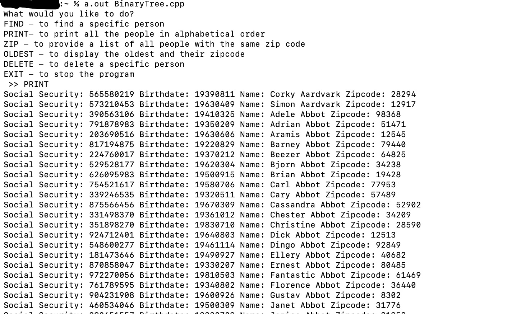
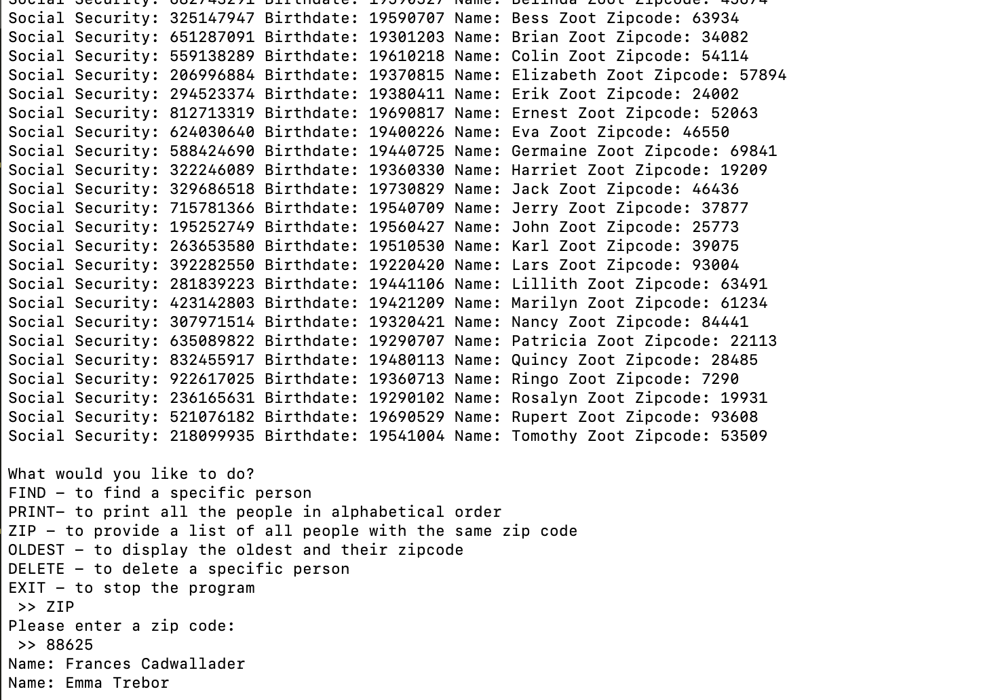
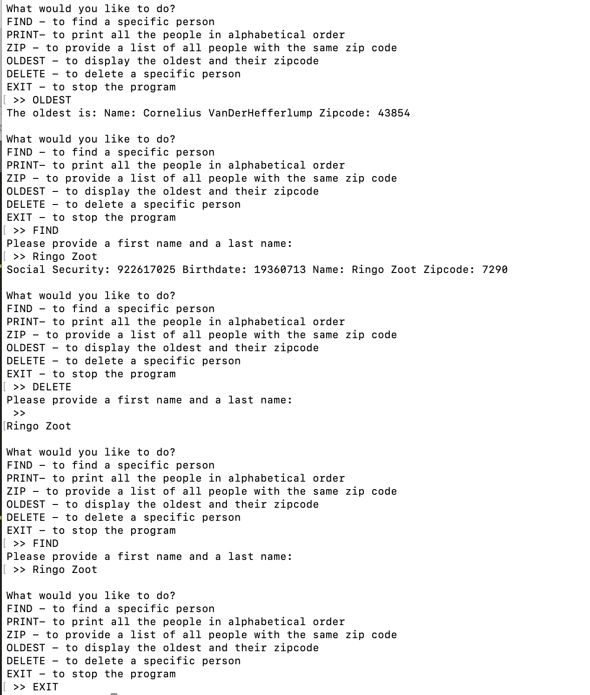
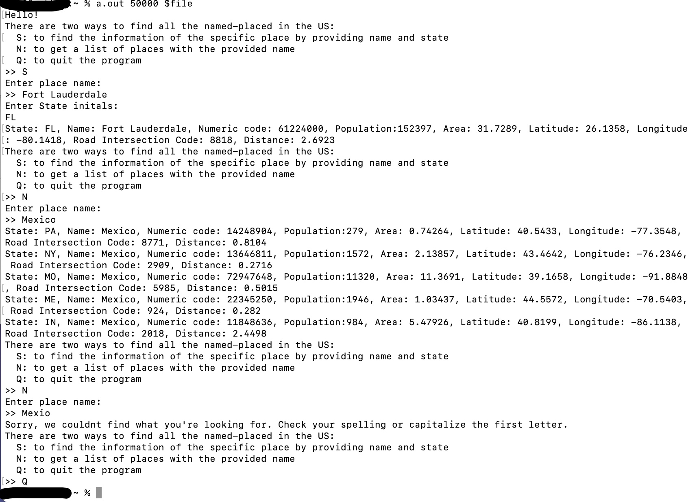

# Algorithms
Sorting algorithms are locted in the sorting folder. Algorithms avilable are:
- Heap
- Merge
- Quick
- Shaker

The README file for compiling and running the sorting algorithms can be found [here](sorting/README.md).

There are some additional algorithms included:
- [Backtracking](/backtracking) exercise in a Sudoku solver
- Missile altitude excerise with [dynamic programming](/dynamic_programming)

Each algorithm has a README explaining the exercise and the approach

# Data Structures
Data structures implemented are avilable in the repository. Data structures avilable are:
- Linked List
- Binary Tree
- Hashtable
- Trie

## Executing
### Database files used
The data structures utilize files with lines of information for people. People objects are created with the format of the files and what the information represents. 

#### Linked List and Binary Tree
This [database file](database.txt) used for the linked list and the binary tree has the following format for each line:

> social_security birthdate first_name last_name zip_code

#### Hashtable
The other [database file](named-places.txt) used, called *named_places.txt* for the hashtable, has the following format for each line:

> numeric_code state_abbreviation place_name population area latitude longitude road_intersection_code intersection_distance

#### Trie
The [file](unix.txt) used for the trie simply has a word list with 1,489 unix related words and identifiers

These files are essential to run the data structure programs

### Running the programs
To compile and run the programs, the GNU compiler is used to create a runnable executable file.

For compilation for the .cpp file, type the following command:

`g++ filename.cpp`

To run the linked list and binary tree, simple type the following command to run the resulting executable:

`a.out`

Most programs have the files with the data used within the program or will have a prompt for the user while it is running.

#### Hashtable

To run the hashtable, additional arguments are needed for the executable. The following command is used:

`a.out sizeTable $filename`

*sizeTable* is the desired size of the hashtable and *$filename* is the name of the database file used.

## Results
The results for the data structures implemented are shown below. 

### Binary Tree

### Hastable

### Trie

