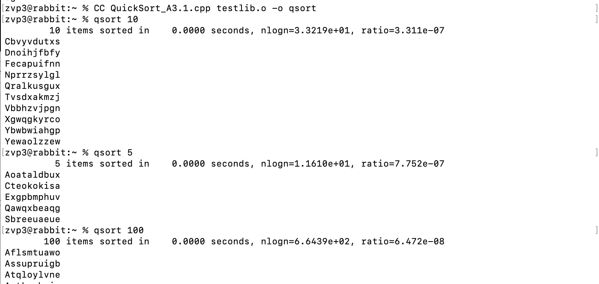
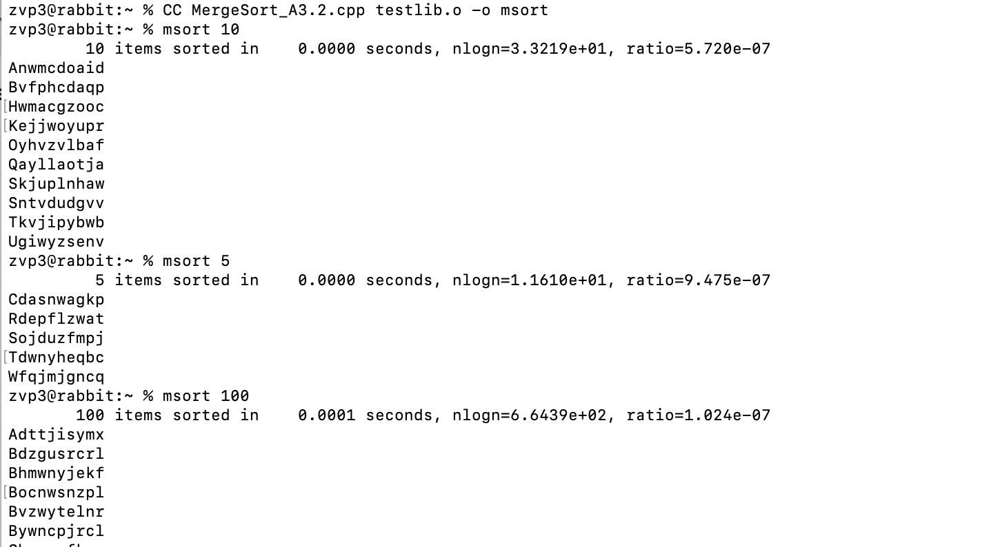
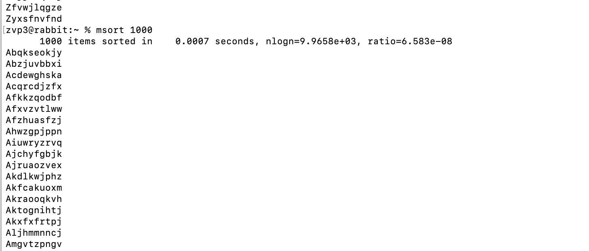

# Sorting Algorithms

## Executing Shaker Sort
To compile the ShakerSort file, type the command:

  `g++ ShakerSort.cpp`
  
To run the shaker sort, type the command:

  `a.out`
  
## Executing Heap, Merge, and Quick Sorts
To compile the heap, merge, and quick sorts, the testlib.cpp file needs to be run first:

  `g++ -c testlib.cpp`
  
Then type the command:

  `g++ sortFile.cpp testlib.o -o sortFile`
  
*sortFile* is the resulting executable file named differently then a.out because of the -o command. 
To run each sort, the executable file and the number of items needs to typed as:

  `sortFile numItems`
  
For example, the list of commands for quick sort:

  `g++ -c testlib.cpp`
  
  `g++ QuickSort.cpp testlib.o -o quicksort`
  
  `quicksort 10`
  
This list of commands will run quicksort on 10 random strings

## Results
The results of each sorting algorithm are shown below. Each run has a different number of random strings and the results show that the strings have been properly sorted with the verification of the testlib library. There is also details about how much time the program needed to sort the random strings along with the nlogn and the ratio.

### Quick Sort

### Merge Sort

